# Diagrama Entidad-Relación · SAE Colegio San Diego

Versión del modelo: v3.2 — alineado con `init-db/01_esquema_base.sql` a `04_triggers_auditoria.sql`.

## Cómo visualizar este diagrama

Tres opciones, ordenadas por practicidad:

1. **GitHub / GitLab**: cualquier repo renderiza los bloques ` ```mermaid ` automáticamente al abrir el `.md`.
2. **VS Code**: instala la extensión *Markdown Preview Mermaid Support* (Matt Bierner) y abre la vista previa con `Ctrl+Shift+V`.
3. **Online**: pega el bloque `mermaid` en <https://mermaid.live> para renderizar y exportar como SVG/PNG.

## Índice de entidades por bloque lógico

Mermaid no agrupa visualmente las entidades; esta tabla cumple esa función para la lectura humana.

| Bloque | Entidades |
|---|---|
| **Configuración y Auditoría** | `configuracion_sistema`, `log_auditoria`, `intento_login`, `usuario` |
| **Académico — Estructura** | `nivel_educativo`, `ciclo_escolar`, `grupo`, `materia`, `grupo_materia`, `docente`, `periodo_evaluacion` |
| **Académico — Comunidad** | `padre`, `alumno`, `inscripcion_ciclo` |
| **Académico — Resultados** | `calificacion`, `asistencia` |
| **Finanzas** | `tarifa`, `calendario_pago`, `pago`, `aplicacion_pago`, `recargo`, `movimiento_saldo`, `factura`, `factura_pago` |
| **Becas** | `beca`, `asignacion_beca`, `ventana_inscripcion_temprana` |
| **Soporte** | `documento`, `notificacion` |

## El diagrama

```mermaid
erDiagram
    %% ===================================================================
    %% BLOQUE 1  CONFIGURACIÓN Y AUDITORÍA
    %% ===================================================================
    usuario {
        int usuario_id PK
        varchar nombre_usuario UK
        varchar password_hash "bcrypt - NUNCA texto plano"
        varchar rol "admin/directora/empleado/estandar"
        int intentos_fallidos
        timestamptz bloqueado_hasta
        timestamptz ultimo_acceso
    }

    configuracion_sistema {
        int config_id PK
        varchar clave "ej recargo_colegiatura_monto"
        text valor "siempre string - backend parsea"
        varchar tipo_dato "int/decimal/bool/json/string"
        int ciclo_id FK "NULL = global"
        int actualizado_por FK
    }

    log_auditoria {
        bigint log_id PK
        int usuario_id FK "del SET LOCAL del backend"
        varchar accion "INSERT/UPDATE/DELETE"
        varchar tabla_afectada
        varchar registro_id
        jsonb valores_antes
        jsonb valores_despues
        timestamptz fecha_hora
        inet direccion_ip
    }

    intento_login {
        int intento_id PK
        int usuario_id FK
        boolean exitoso
        inet direccion_ip
        timestamptz creado_en
    }

    %% ===================================================================
    %% BLOQUE 2  ACADÉMICO - ESTRUCTURA
    %% ===================================================================
    nivel_educativo {
        int nivel_id PK
        varchar codigo UK "PREESCOLAR/PRIMARIA/SECUNDARIA/BACHILLERATO"
        varchar nombre
        varchar rvoe
        int orden
    }

    ciclo_escolar {
        int ciclo_id PK
        varchar nombre UK "2026-2027"
        date fecha_inicio
        date fecha_fin
        boolean activo "solo uno activo a la vez"
    }

    docente {
        int docente_id PK
        int usuario_id FK "opcional - puede no tener cuenta"
        varchar nombre_completo
        citext correo
    }

    grupo {
        int grupo_id PK
        int ciclo_id FK
        int nivel_id FK
        int docente_titular_id FK
        varchar grado
        varchar seccion
        varchar nombre "4°A Primaria"
    }

    materia {
        int materia_id PK
        int nivel_id FK
        varchar nombre
        varchar tipo "curricular/club/taller"
        boolean cuenta_para_promedio "RF-59 Taller NO entra"
    }

    grupo_materia {
        int grupo_materia_id PK
        int grupo_id FK
        int materia_id FK
        int docente_id FK
        varchar horario
        varchar aula
    }

    periodo_evaluacion {
        int periodo_id PK
        int ciclo_id FK
        int nivel_id FK
        varchar tipo "bloque/trimestre/bimestre/semestre"
        int numero
        date fecha_inicio
        date fecha_fin
    }

    %% ===================================================================
    %% BLOQUE 3  ACADÉMICO - COMUNIDAD
    %% ===================================================================
    padre {
        int padre_id PK
        varchar nombre_completo
        varchar rfc UK
        varchar regimen_fiscal
        varchar uso_cfdi
        boolean requiere_factura
        varchar tipo_pago_habitual
        numeric saldo_a_favor "RF-36 bolsa de excedente"
    }

    alumno {
        int alumno_id PK
        varchar matricula UK
        varchar curp UK
        int padre_id FK "1:N actual; pendiente N:M"
        int nivel_id FK
        varchar estado "Activo/Baja Temporal/Baja Definitiva/Egresado"
        jsonb personas_autorizadas "RF-09 recogida"
        date fecha_nacimiento
    }

    inscripcion_ciclo {
        int inscripcion_id PK
        int alumno_id FK
        int ciclo_id FK
        int grupo_id FK
        varchar plan_pago "10_meses o 12_meses"
        date fecha_ingreso
        varchar estado_en_ciclo "activa/baja_temporal/..."
    }

    %% ===================================================================
    %% BLOQUE 4  ACADÉMICO - RESULTADOS
    %% ===================================================================
    calificacion {
        int calificacion_id PK
        int alumno_id FK
        int materia_id FK
        int periodo_id FK
        int ciclo_id FK
        varchar tipo_evaluacion "numerica/cualitativa/observacion"
        numeric valor_numerico "0-10"
        varchar valor_cualitativo "A/NA RF-59"
        text texto_observacion "RF-57 preescolar"
        boolean cuenta_para_promedio
    }

    asistencia {
        int asistencia_id PK
        int alumno_id FK
        int grupo_id FK
        int materia_id FK "NULL = del día completo"
        date fecha
        varchar estado "presente/ausente/retardo"
        text justificacion
    }

    %% ===================================================================
    %% BLOQUE 5  FINANZAS
    %% ===================================================================
    tarifa {
        int tarifa_id PK
        int ciclo_id FK
        int nivel_id FK
        varchar concepto "inscripcion/colegiatura/material/uniforme"
        numeric monto
    }

    calendario_pago {
        int calendario_pago_id PK
        int alumno_id FK
        int ciclo_id FK
        varchar concepto
        varchar mes
        date fecha_vencimiento
        numeric monto_original
        numeric monto_pagado
        numeric monto_recargo
        numeric saldo_pendiente "GENERATED - calculada por Postgres"
        varchar estado_cobro "pendiente/parcial/pagado/vencido/condonado"
    }

    pago {
        int pago_id PK
        int alumno_id FK "NULL si pago familiar distribuido RF-37"
        int padre_id FK
        int registrado_por FK
        int comprobante_id FK
        date fecha_pago
        numeric monto_total
        varchar metodo_pago "transferencia/deposito/tarjeta/efectivo"
    }

    aplicacion_pago {
        int aplicacion_id PK
        int pago_id FK
        int calendario_pago_id FK
        numeric monto_aplicado
        varchar aplicado_a "capital/recargo"
    }

    recargo {
        int recargo_id PK
        int calendario_pago_id FK
        int modificado_por FK
        numeric monto_original
        numeric monto_actual
        varchar estado "aplicado/reducido/condonado RF-33"
        text motivo_modificacion
    }

    movimiento_saldo {
        int movimiento_id PK
        int padre_id FK
        int pago_id FK
        int aplicacion_id FK
        varchar tipo "abono/aplicacion/reverso"
        numeric monto
    }

    factura {
        int factura_id PK
        int padre_id FK
        int emitida_por FK
        int xml_documento_id FK
        int pdf_documento_id FK
        varchar numero_factura UK
        uuid uuid_sat
        numeric monto_total
        varchar estado "emitida/cancelada/pendiente"
    }

    factura_pago {
        int factura_id PK_FK
        int pago_id PK_FK
        numeric monto
    }

    %% ===================================================================
    %% BLOQUE 6  BECAS
    %% ===================================================================
    beca {
        int beca_id PK
        varchar nombre_beca UK
        varchar criterio "hermanos/calificacion/inscripcion_temprana/..."
        numeric porcentaje_default
    }

    asignacion_beca {
        int asignacion_id PK
        int alumno_id FK
        int beca_id FK
        int ciclo_id FK
        int asignada_por FK
        int retirada_por FK
        numeric porcentaje
        varchar estado "activa/retirada/finalizada"
        text motivo_retiro
    }

    ventana_inscripcion_temprana {
        int ventana_id PK
        int ciclo_id FK
        int beca_id FK
        date fecha_inicio
        date fecha_fin
        numeric porcentaje
    }

    %% ===================================================================
    %% BLOQUE 7  SOPORTE
    %% ===================================================================
    documento {
        int documento_id PK
        int alumno_id FK
        int padre_id FK
        int pago_id FK
        int factura_id FK
        int subido_por FK
        varchar tipo_documento
        text ruta_almacen
        char hash_sha256
    }

    notificacion {
        int notificacion_id PK
        int destinatario_padre_id FK
        int destinatario_usuario_id FK
        int alumno_id FK
        int calendario_pago_id FK
        varchar tipo
        varchar estado "pendiente/enviada/fallida/leida"
        timestamptz programada_para
    }

    %% ===================================================================
    %% RELACIONES
    %% Notación Mermaid:
    %%   ||--o{   uno a muchos (uno obligatorio, muchos opcional)
    %%   ||--o|   uno a uno opcional
    %%   }o--o{   muchos a muchos (vía tabla puente)
    %% ===================================================================

    %% --- Configuración y Auditoría
    ciclo_escolar     ||--o{ configuracion_sistema : "override por ciclo"
    usuario           ||--o{ configuracion_sistema : "modifica"
    usuario           ||--o{ log_auditoria         : "registra"
    usuario           ||--o{ intento_login         : "intenta acceso"

    %% --- Estructura académica
    nivel_educativo   ||--o{ grupo                 : "categoriza"
    ciclo_escolar     ||--o{ grupo                 : "contiene"
    docente           ||--o{ grupo                 : "titular de"
    usuario           ||--o| docente               : "puede ser"
    nivel_educativo   ||--o{ materia               : "ofrece"
    grupo             ||--o{ grupo_materia         : "compone"
    materia           ||--o{ grupo_materia         : "se imparte en"
    docente           ||--o{ grupo_materia         : "asignado a"
    ciclo_escolar     ||--o{ periodo_evaluacion    : "estructura temporal"
    nivel_educativo   ||--o{ periodo_evaluacion    : "define para"

    %% --- Comunidad
    padre             ||--o{ alumno                : "tutor de (1:N)"
    nivel_educativo   ||--o{ alumno                : "cursa"
    alumno            ||--o{ inscripcion_ciclo     : "se inscribe"
    ciclo_escolar     ||--o{ inscripcion_ciclo     : "registra"
    grupo             ||--o{ inscripcion_ciclo     : "agrupa"

    %% --- Resultados académicos
    alumno            ||--o{ calificacion          : "recibe"
    materia           ||--o{ calificacion          : "evaluada"
    periodo_evaluacion ||--o{ calificacion         : "durante"
    ciclo_escolar     ||--o{ calificacion          : "del ciclo"
    alumno            ||--o{ asistencia            : "registra"
    grupo             ||--o{ asistencia            : "en grupo"
    materia           ||--o{ asistencia            : "por materia (opc)"

    %% --- Finanzas (núcleo)
    ciclo_escolar     ||--o{ tarifa                : "define precios"
    nivel_educativo   ||--o{ tarifa                : "por nivel"
    alumno            ||--o{ calendario_pago       : "adeuda"
    ciclo_escolar     ||--o{ calendario_pago       : "ciclo del cargo"
    alumno            ||--o{ pago                  : "asociado a"
    padre             ||--o{ pago                  : "paga"
    usuario           ||--o{ pago                  : "registra"
    pago              ||--o{ aplicacion_pago       : "se distribuye"
    calendario_pago   ||--o{ aplicacion_pago       : "salda"
    calendario_pago   ||--o{ recargo               : "genera"
    usuario           ||--o{ recargo               : "modifica"

    %% --- Saldos y facturación
    padre             ||--o{ movimiento_saldo      : "bolsa de saldo"
    pago              ||--o{ movimiento_saldo      : "origina"
    aplicacion_pago   ||--o{ movimiento_saldo      : "consume"
    padre             ||--o{ factura               : "facturada a"
    usuario           ||--o{ factura               : "emite"
    factura           ||--o{ factura_pago          : "agrupa pagos"
    pago              ||--o{ factura_pago          : "facturado en"

    %% --- Becas
    beca              ||--o{ asignacion_beca       : "tipo aplicado"
    alumno            ||--o{ asignacion_beca       : "beneficiario"
    ciclo_escolar     ||--o{ asignacion_beca       : "en ciclo"
    usuario           ||--o{ asignacion_beca       : "gestiona"
    ciclo_escolar     ||--o{ ventana_inscripcion_temprana : "promoción"
    beca              ||--o{ ventana_inscripcion_temprana : "ofrece"

    %% --- Soporte
    alumno            ||--o{ documento             : "expediente"
    padre             ||--o{ documento             : "expediente"
    pago              ||--o{ documento             : "comprobante"
    factura           ||--o{ documento             : "XML/PDF"
    usuario           ||--o{ documento             : "sube"
    padre             ||--o{ notificacion          : "recibe"
    usuario           ||--o{ notificacion          : "recibe interna"
    alumno            ||--o{ notificacion          : "contexto"
    calendario_pago   ||--o{ notificacion          : "origen del aviso"
```



## Notas técnicas sobre el modelo

### Arquitectura de reglas: dónde vive la lógica de negocio

Las decisiones automáticas del sistema (recargo de $400, baja temporal por 3 meses de adeudo, retiro de beca por mora) **no viven en la base de datos**. Se ejecutan como jobs programados en el backend, que lee los umbrales desde `configuracion_sistema` y aplica las reglas con plena trazabilidad en logs de aplicación. La razón: RF-33 exige condonar y modificar recargos con motivo, lo cual requiere trazabilidad explícita que un Trigger no provee.

### Triggers en la base de datos: solo auditoría

Los Triggers de PostgreSQL (`fn_audit_trigger`) están activos exclusivamente sobre las tablas `pago`, `alumno` y `usuario`. Su única responsabilidad es escribir en `log_auditoria` cada INSERT/UPDATE/DELETE, capturando el usuario operador desde el parámetro de sesión `sae.usuario_id` que el backend establece con `SET LOCAL` al inicio de cada transacción. Esto es **integridad pura**, no lógica de negocio.

### Particularidades del diseño que conviene resaltar

- **`calendario_pago.saldo_pendiente`** es una **columna calculada** (`GENERATED ALWAYS AS STORED`). PostgreSQL la mantiene siempre coherente con `monto_original + monto_recargo - monto_pagado`. Es imposible que quede desincronizada.
- **`pago.alumno_id` es nullable** porque el RF-37 permite que un padre haga un único pago que se distribuya entre varios hijos mediante la tabla puente `aplicacion_pago`.
- **`asistencia.materia_id` es opcional**: si es NULL, representa asistencia general del día (uso típico en primaria); si tiene valor, es asistencia específica de una materia (uso en secundaria/bachillerato).
- **`factura ↔ pago` es N:M** vía `factura_pago`, no 1:1. Soporta el complemento de pagos del SAT donde una factura agrupa varios pagos.
- **`configuracion_sistema.ciclo_id` puede ser NULL** para parámetros globales o tener valor para override por ciclo escolar.

### Decisiones pendientes que el diagrama refleja

- **`padre → alumno` está como 1:N** (`alumno.padre_id`). Una migración futura a N:M vía `tutor_alumno` permitiría modelar padres separados, tutores legales o abuelos como responsables. Por ahora se mantiene 1:N para no bloquear avance.

## Leyenda de notación Mermaid ER

| Símbolo | Significado |
|---|---|
| `\|\|--\|\|` | Uno a uno obligatorio en ambos extremos |
| `\|\|--o\|` | Uno a uno donde el segundo es opcional |
| `\|\|--o{` | Uno a muchos (uno obligatorio, muchos opcional) — el más común |
| `}o--o{` | Muchos a muchos (siempre vía tabla puente) |
| `PK` | Primary Key |
| `FK` | Foreign Key |
| `UK` | Unique Key |
| `PK_FK` | Clave primaria compuesta que también es foránea |
